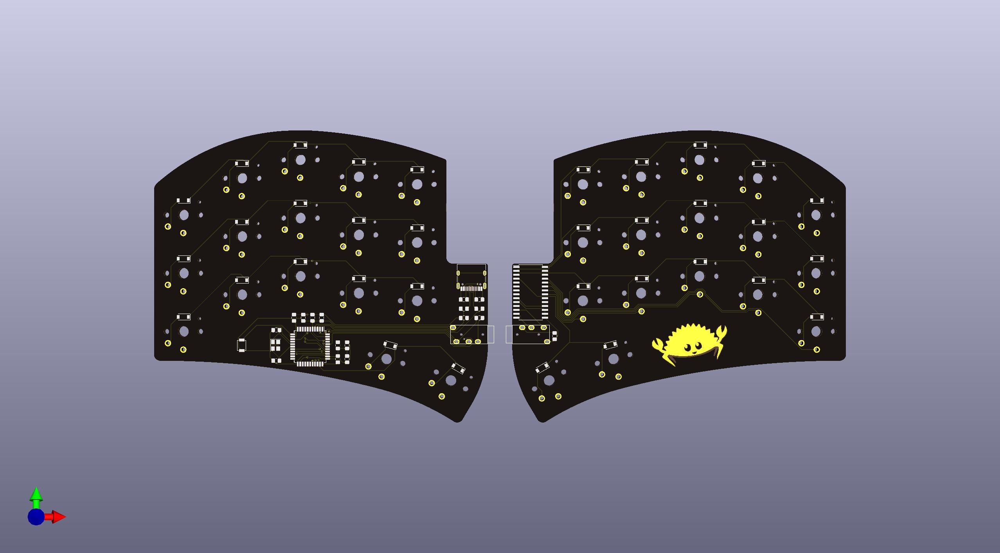

Meet Ferris, a minimalistic keyboard
====================================

Named after the Rustlang mascott, ferris is a 34 keys split keyboard that tries to be about as cute as its namesake.

Ferris is minimalistic: it aims to be a functional, ergonomic keyboard that is pleasing to use as a daily driver. It only supports choc keyswitches, although it would be easy to make a MX version if there was interest.

Goals:
------
* Comfort
* Aesthetics
* Portability
* Ease of assembly
* Low-Cost
* Low-Profile
* 34 keys
* Hackable
* USB-C
* No compromise

Non-Goals:
----------
* Reversible PCB used for both hands
* Pro-micro/Elite C/Proton C support
* Hot-Swap support
* Multi-switches support
* Support for any feature (RGB, OLED, encoders, ...) that is not of interest to the user

Philosophy:
-----------
Most boards provide many features that the Ferris does not provide. The most basic example would be MX switch support. MX switches are the Lingua Franca of switches and footprints supporting both MX and choc switches are readily available. It almost seems silly not to provide MX compatibility for those users who may desire it.
This specific example illustrates a philosophical difference between the Ferris and most other boards: the Ferris is built around the "Keep It Simple, Stupid" philosophy present in Arch Linux and other software projects. If the user doesn't need a feature, do not offer it and the trade-offs that go with it. The user knows better. If they want that feature, they can add it themselves. There is nothing wrong with MX switches, but when supporting both MX and chocs, a couple of things happen: The board contains unnecessary holes, which compromises on the aesthetics goal. The choc or the MX switches end up upside down, which again compromises with the aesthetics.

By following these guiding principles, we end up with a clean design that should be easy to modify to adapt any other set of user requirements.

Work In Progress:
-----------------
More documentation is coming. Both to dive into a bit more details on the decisions and to discuss the technicalities around the keyboard. Stay tuned!
